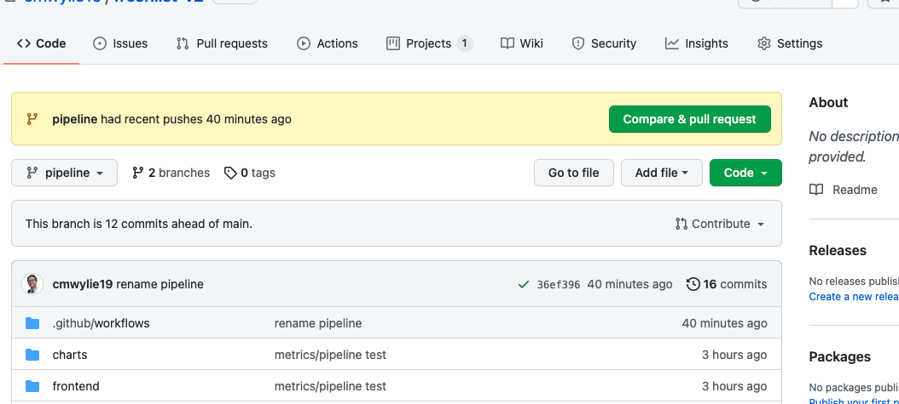
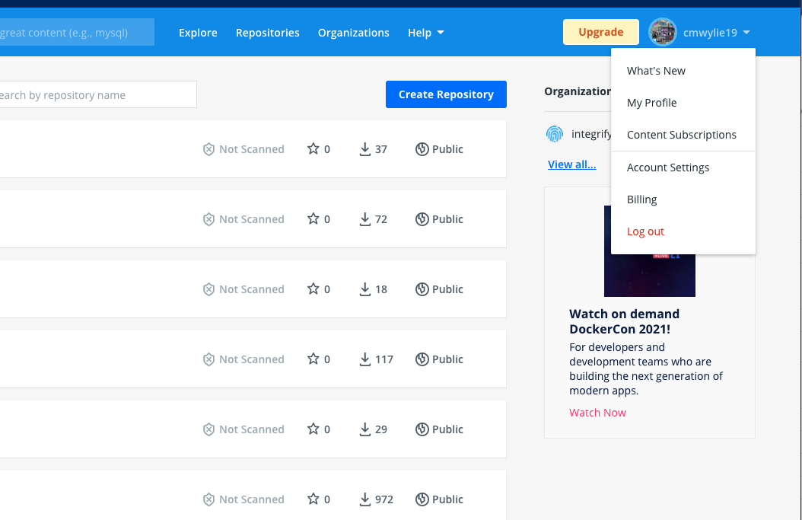
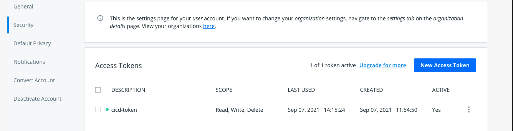

> # Background
_CICD Pipelines are a fundamental part of the devops process. Pipelines are responsible for unit tests, integration tests, performance tests, static code analysis, security tests/scans, building images, and deploying applications. In this post we will look into how to setup a GitHub actions pipeline to build a container based on the source code and deploy into a production environment (GKE)._

**Note**- GitHub Actions pipeline may not fit all usecases. For example, a lot of people prefer to host the pipeline within their clusters to be able to collect metrics and logs from the pipeline. This is likely possible through a GitHub actions pipeline but I have not looked into how to accomplish this yet.


## Prereqs
- a GitHub repository
- a folder in the repository that contains a dockerfile, source code, and kubernetes manifests
- a dockerhub account
- a GKE Cluster

## Create Project scaffolding
First, lets check if we have our repository setup correctly. Change directories to the folder of the GitHub repository. From there, if you issue the `ls` command, you should see at least one folder that contains source code of the application that you want to deploy through the pipeline, and a dockerfile to containerize the application. Inside of the folder containing your source code, you should have an additional directory, `k8s`, where you will put the kubernetes manifests necessary to deploy the application. In my repository, I have a folder called `frontend` that contains the dockerfile and source code to build a react app, and a folder k8s that consists of a `deployment, service, and service-account` for my application.

```
github-repo
- frontend
  - k8s 
    - Deployment.yaml
    - Service.yaml
    - ServiceAccount.yaml
  - Dockerfile
  - source code (index.js)
```

## Create the Pipeline manifest
Currently, you should only have one folder that contains your application code, now we are going to make another folder to house the pipeline manifest file.
```
mkdir -p .github/workflows
```

Now, we are going to create a file called `build-push.yaml` inside of `.github/workflows`.   
```
name: Build/Push Action
on: [push]
env:
  PROJECT_ID: ${{ secrets.GKE_PROJECT }}
  GKE_CLUSTER: freshlist-v2
  GKE_ZONE: us-east1-b 
jobs:
  setup-build-push-deploy:
    runs-on: ubuntu-latest
    steps:
      - name: Check out repository code
        uses: actions/checkout@v2

      - name: Set up QEMU
        uses: docker/setup-qemu-action@v1
    
      - name: Set up Docker Buildx
        uses: docker/setup-buildx-action@v1

      - name: Set up Kustomize
        run: |-
          curl --location https://github.com/kubernetes-sigs/kustomize/releases/download/kustomize%2Fv4.2.0/kustomize_v4.2.0_linux_amd64.tar.gz | tar xz
          chmod u+x ./kustomize

      - uses: google-github-actions/setup-gcloud@94337306dda8180d967a56932ceb4ddcf01edae7
        with:
          service_account_key: ${{ secrets.GKE_SA_KEY }}
          project_id: ${{ secrets.GKE_PROJECT }}
      
      # Get the GKE credentials so we can deploy to the cluster
      - uses: google-github-actions/get-gke-credentials@fb08709ba27618c31c09e014e1d8364b02e5042e
        with:
          cluster_name: ${{ env.GKE_CLUSTER }}
          location: ${{ env.GKE_ZONE }}
          credentials: ${{ secrets.GKE_SA_KEY }}

      # Get Dockerhub crednetials so we can push to dockerhub
      - name: Login to DockerHub
        uses: docker/login-action@v1
        with:
          username: ${{ secrets.DOCKERHUB_USERNAME }}
          password: ${{ secrets.DOCKERHUB_TOKEN }}

      # Build a container from the source code in the /frontend directory
      - name: Build and push UI
        uses: docker/build-push-action@v2
        with:
          context: ./frontend
          push: true
          tags: cmwylie19/freshlist-v2-frontend:latest

      # Deploy the new source code into the cluster
      - name: Deploy UI
        run: |-
          kubectl apply -f ./frontend/k8s
          kubectl rollout restart deploy/frontend

      - run: echo "🍏 This job's status is ${{ job.status }}."
```

Our repo should now have the following format:
```
github-repo
- frontend
  - k8s 
    - Deployment.yaml
    - Service.yaml
    - ServiceAccount.yaml
  - Dockerfile
  - source code (index.js)
- .github
  - workflows
    - build-push.yaml
```
## Pipeline Explanation
This pipeline is called `Build/Push Action`. The steps the pipeline takes are:
- Download pipeline dependencies (actions, QEMU, docker, kustomize)
- Authenticate in GKE with your `service_account_key` from `gcloud` (explanation coming)
- Authenticate in Dockerhub with username and token
- Build a container from the `./frontend` directory and push to `docker.io/cmwylie19/freshlist-v2-frontend:latest`
- Deploy the container by applying the manifests from `./frontend/k8s` and restart the deployment in GKE


## Enable the API in GKE
Enable the Kubernetes Enginer and Container Registry API:
```
gcloud services enable \
	containerregistry.googleapis.com \
	container.googleapis.com
```

## Setup Secrets in GitHub
We need to set some secrets in GitHub that our pipelines needs. To add secrets in Github:
- go to the github of the repo `github.com/{username}/{repo}`
- click settings  
- click secrets on the left panel

## Get Dockerhub token
Go to dockerhub and click on your account, and then click `Account Settings`   
   

Then click `Security` on the left side.   
   
   
   
Then Click `New Access Token`, copy the contents of your access token to the GitHub Secrets above, name the secret `DOCKERHUB_TOKEN`.

Create a new secret in GitHub called `DOCKERHUB_USERNAME` with the username that you use for Dockerhub.

It's worth validating that your credentials are correct.
```
docker login -u <dockerhub_username>
```

## Create a GKE Service Account and Assign roles
This demonstrates how to create the service account for your GKE integration. We will create the service account, add roles to it, retrieve its keys, and store them as a base64 encoded secret named `GKE_SA_KEY`.

Assign `GKE_PROJECT` to value of your **project ID**, not the name, not the project_number.
```
# Get a list of projects and their ids
gcloud projects list

GKE_PROJECT=<project_id>
```     

Create a new Service Account, `pipeline-sa`
```
gcloud iam service-accounts create pipeline-sa
```

Get the email of the service account that we just created.
```
gcloud iam service-accounts list | grep pipeline-sa
```

Assign SA_EMAIL to the value of the service-account's email
```
SA_EMAIL=pipeline-sa@<project-id>.iam.gserviceaccount.com
```                                    

Add Roles to the Service Account
```
gcloud projects add-iam-policy-binding $GKE_PROJECT \
  --member=serviceAccount:$SA_EMAIL \
  --role=roles/container.admin \
  --role=roles/storage.admin \
  --role=roles/container.clusterViewer \
  --role=roles/container.developer
```

Download the JSON keyfile for the service account and delete after:
```
gcloud iam service-accounts keys create key.json --iam-account=$SA_EMAIL
```

Set `GKE_SA_KEY` to the value of the `key.json` file that was generated for you, and copy
```
export GKE_SA_KEY=$(cat key.json | base64)
echo $GKE_SA_KEY | pbcopy
```

Add `GKE_SA_KEY` as a GitHub Secret, with the value of $GKE_SA_KEY

Delete the key.json file because you do not want that tracked in your repository as it has sensitive information.
```
rm key.json
```

_Now push your code to GitHub and try the new pipeline._
## Summary

This guide was meant to give you a minimum working pipeline, the next steps to accomplish are to add elements to your pipeline to unit test, integration test, performance test, security test, and analyze static code to ensure that the code that is making it through the pipeline is ready for prod.

There is a link below that refences the document on how to deploy to GKE, although the roles added to the service account in the document **did not work.** I had to add `--role=roles/container.developer` to fully get the pipeline working.

## References
[Deploying to GKE](https://docs.github.com/en/actions/guides/deploying-to-google-kubernetes-engine)