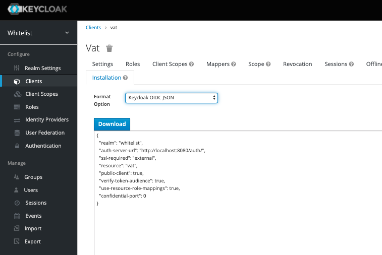

> ### _Quick and dirty: How to secure endpoints via keycloak using roles_

This was written using node and TypeScript, if you are using regular JavaScript; just drop the types.

_Keycloak middleware can be used to secure backend endpoints to ensure that only users with the correct roles are able to access them_

### Install Keycloak Connect and express-session

```
npm i --save-dev keycloak-connect

npm i --save-dev express-session
```

### Create a keycloak config file

_keys from this keycloak config can be found in the keycloak admin console under the client_



```
export const keycloakConfig: any = {
  realm: process.env.REALM,
  "auth-server-url": process.env.AUTH_SERVER_URL,
  "ssl-required": "external",
  resource: process.env.CLIENT,
  "confidential-port": 0,
  "enable-cors": true
}

```

### Create the session store and initialize keycloak

```
const memoryStore = new session.MemoryStore();
const keycloak = new Keycloak({ store: memoryStore, scope: "offline_access" }, keycloakConfig);

```

### Apply keycloak protect middleware and a function to lock down endpoints for a particular role.

_lets assume you have a route controller called User Route Controller, apply middleware on that route to only allow users with the ADMIN role to be able to access that route_

```
app.use('/users', keycloak.protect("realm: ADMIN"), UserRouteController())

```
