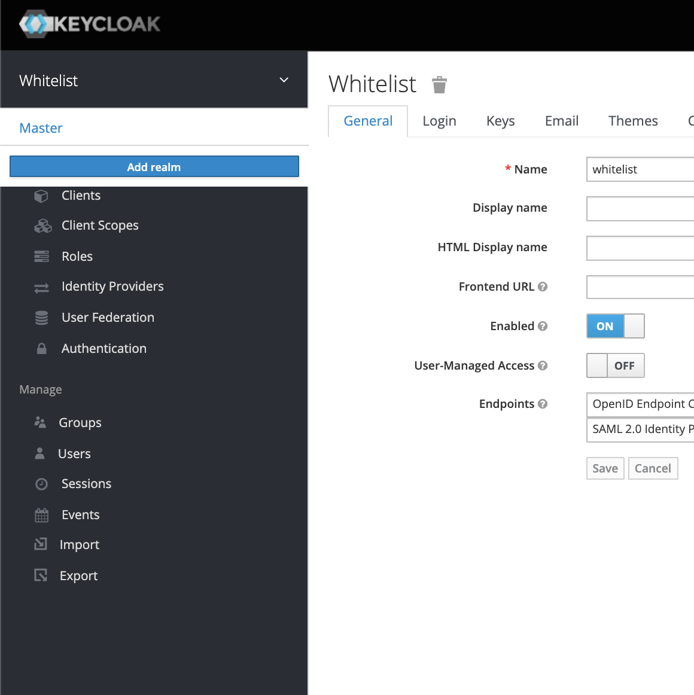
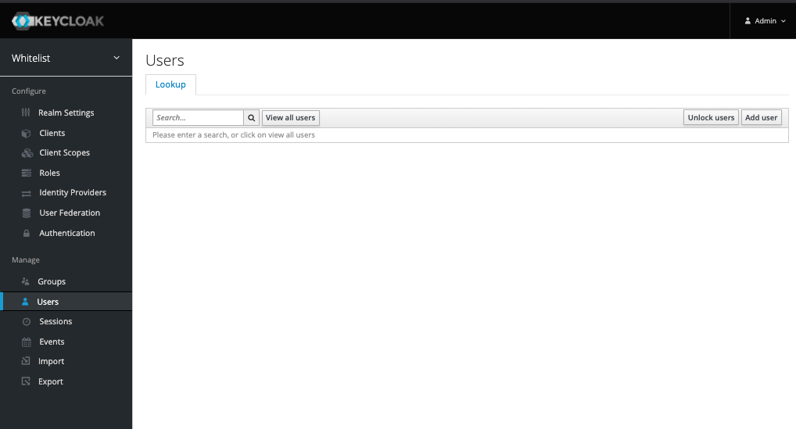
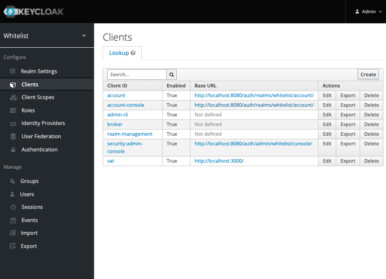
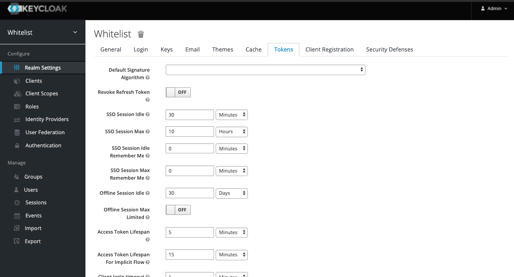

> ### This guide aims to outline several key functionalities in User Interface.

### Table Of Contents
____
+ Spinning Up Keycloak
+ Getting familiar with the UI
  * Logging into the Admin Console
  * Creating a realm
  * Adding a user
  * Creating a Client (Application)
  * Accessing the realm tokens


## Spin up Keycloak locally
___________________________

```
> docker run -d -p 8080:8080 -e KEYCLOAK_USER=admin -e KEYCLOAK_PASSWORD=admin -e DB_VENDOR=H2 jboss/keycloak
```


## Using the User Interface

_This part of the guide is focuses on getting to know your way around the keycloak admin interface_

#### Log into the console
____
Hit http://localhost:8080/auth/admin in your browser of choice and enter "admin" (no quotes) for both the username and password.
<br />


#### Creating a realm
______
_The realm in keycloak secures and manages security metadata for a set of users. If you have used Cognito it is comparable to the user pool_


Scroll over text "Master" on the top left and a dropdown menu will appear with button "Add Realm", click that. Next you will be presented with a text box to add the name of the realm, and click create. 
<br />



### Create a user
___
There is also another way to create a user in keycloak . 
- From the left side menu, click Users
- On the right side, click the button "Add User"
<br />





### Creating a Client
_____
_In keycloak, client refers to a client application_

We will go into more detail of creating a client in the _Locking down applications sector of the guide_.

- Login into the admin console
- Click clients in the left side menu 
- On the right hand side, click the create button
<br />





### Managing Tokens
___
- In the left side menu select Realm Settings 
- On the top menu of the realm settings select tokens 
<br />



## Operating Modes

> **Standalone mode** - This is useful whhen only one instance of the Keycloak Server is necessary. This mode is not recommended for production since this  introduces a single point of failure.

[More info can be found here ](https://www.keycloak.org/docs/latest/server_installation/)


> **Standalone Clustered Mode** - This is the approach for using the Keycloak server from within a cluster. It requires an instance of Keycloak on each machine. It is easy to deploy, but difficult to maintain as changes require modifying the configuration on each machine.

[More info can be found here ](https://www.keycloak.org/docs/latest/server_installation/)


> **Domain Clustered Mode** - This mode is a way to manage your keycloak servers from a centralized location, normally, each time you make a configuration change, that change needs to be replication in each Keycloak server instance, with domain cluster mode you make a change to a centralized location and publish the change so it is reflected in the other keycloak instances.
