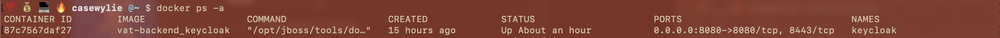

> ### This guide aims to teach how to create a custom theme in keycloak

## Step 1: Spin up the keycloak container

---

```
> docker run -d -p 8080:8080 -e KEYCLOAK_USER=admin -e KEYCLOAK_PASSWORD=admin -e DB_VENDOR=H2 jboss/keycloak
```

## Step 2: Docker exec into the container

```
> docker ps -a
```



```
> docker exec -it 87c7567daf27 bash
```


## Step 3: Go to the themes folder

```
> cd opt/jboss/keycloak/themes
```

_from here you have the choice to edit the base theme, which does not have default styling or the keycloak theme, which is not suggested in the keycloak docs, but i prefer it because it is a good starting point_

## Step 4:

assuming we are going to add on to the keycloak default theme

```
> cd keycloak
```

from here you have the choices of editing the following interfaces

- login
- email
- account
- welcome
- common
